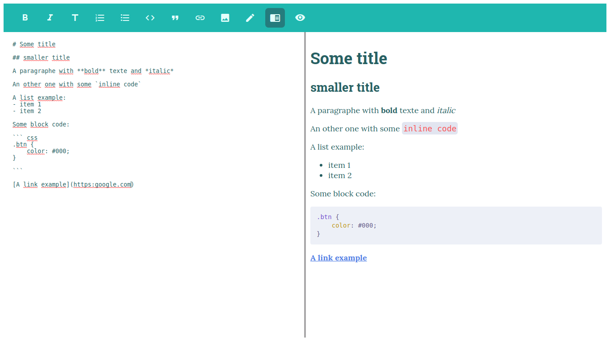

<!--
*** Thanks for checking out this README Template. If you have a suggestion that would
*** make this better please fork the repo and create a pull request or simple open
*** an issue with the tag "enhancement".
*** Thanks again! Now go create something AMAZING! :D
-->


<!-- PROJECT LOGO -->
<br />
<p align="center"><h3 align="center">Markdown-Editor-Vue</h3>

  <p align="center">
    A simple Markdown editor using VueJs
    <br />
    ·
    <a href="https://github.com/mthdht/markdown-editor-vue/issues">Report Bug</a>
    ·
    <a href="https://github.com/mthdht/markdown-editor-vue/issues">Request Feature</a>
  </p>
</p>


<!-- TABLE OF CONTENTS -->
## Table of Contents

* [About the Project](#about-the-project)
  * [Built With](#built-with)
* [Getting Started](#getting-started)
  * [Prerequisites](#prerequisites)
  * [Installation](#installation)
* [Usage](#usage)
* [Contributing](#contributing)
* [License](#license)
* [Contact](#contact)
* [Acknowledgements](#acknowledgements)


<!-- ABOUT THE PROJECT -->
## About The Project



### Built With
* [Vue js](https://vuejs.org/)


<!-- GETTING STARTED -->
## Getting Started


### Prerequisites

* npm
```sh
npm install npm@latest -g
```

### Installation

1. Install NPM packages
```sh
npm install markdown-editor-vuejs
```


<!-- USAGE EXAMPLES -->
## Usage

First, you have to import the newly installed package
``` javascript
// other import
import MarkdownEditor from 'markdown-editor-vuejs'

export default {
    // your component code
}
```

Then, you can use the component anywhere in your template:
```javascript
<template>
    <markdown-editor></markdown-editor>
</template>
```

By default, this markdown editor has teal color theme but you can change it by passing a color prop.

The colors available are: **gray** - **red** - **orange** - **yellow** - **green** - **teal** - **blue** - **indigo** - **purple** - **pink**

You can also change the basic default theme to be lighter or darker

the themes available are: **light** - **dark** - **basic**

```javascript
<markdown-editor color="blue" theme="dark"></markdown-editor>
```


<!-- CONTRIBUTING -->
## Contributing

Contributions are what make the open source community such an amazing place to be learn, inspire, and create. Any contributions you make are **greatly appreciated**.

1. Fork the Project
2. Create your Feature Branch (`git checkout -b feature/AmazingFeature`)
3. Commit your Changes (`git commit -m 'Add some AmazingFeature`)
4. Push to the Branch (`git push origin feature/AmazingFeature`)
5. Open a Pull Request


<!-- LICENSE -->
## License

Distributed under the MIT License. 

<!-- CONTACT -->
## Contact

Mthdht - [@your_twitter](https://twitter.com/mthdht) - mthdht@gmail.com

Project Link: [https://github.com/mthdht/markdown-editor-vue](https://github.com/mthdht/markdown-editor-vue)


<!-- ACKNOWLEDGEMENTS -->
## Acknowledgements
* [Material icon](https://material.io/tools/icons/?style=baseline)
* [Prism js](https://prismjs.com/#basic-usage)
* [Marked](https://marked.js.org/#/README.md#README.md)